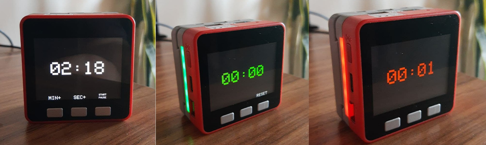

## M5 Stack Countdown/Timer

---
 

- Set up minutes (up to 99)/seconds using the A/B buttons and start countdown with C button. 

- You can pause/continue at any time using C button or hold it to clear and start over. 

- Last 10 seconds will change timer font color and beep and last 3 seconds will double beep on each second.

- Use LEDs on M5 Fire Stack